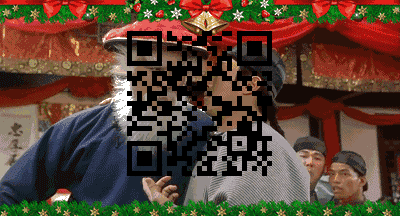
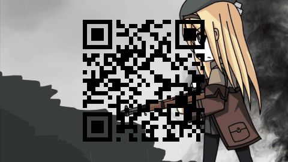

# BitQR-Code
Through image generate QR-Code .

一个优雅的 QR 二维码生成器

--------

## 样例

> 拿起你的手机扫描下面的二维码试试吧！


原图 | Version-3 | Version-5 | 直接拼凑GIF | 分解生成GIF
------------ | ------------- | ------------- | ------------- | -------------
  |  |   |  |  

原图1 | 原图2 | 原图3 |
------------ | ------------- | -------------
 |  |  
GIF1 | GIF2 | GIF3 |
------------ | ------------- | -------------
 |  |  

------

> GIF分解为多个帧

原GIF | 第四帧 | 第七帧 | 第十帧 |
------------- | ------------- | ------------- | -------------
  |   |   | 


 第十三帧 | 第十六帧 | 第二十帧 | 生成GIF |
------------- | ------------- | ------------- | ------------- 
  |   |   |  


> 2018年最后一天的最后一篇

## 引用

在项目中导入  QRCode.jar 以添加依赖：

```
<component name="libraryTable">
  <library name="QRCode">
    <CLASSES>
      <root url="jar://$PROJECT_DIR$/src/lib/QRCode.jar!/" />
    </CLASSES>
    <JAVADOC />
    <SOURCES />
  </library>
</component>
```

## 快速上手

#### 1. "快速导入背景图片"

> <del>只想显示一张麻衣学姐的照片</del>

```java
BufferedImage writeImg = ImageIO.read(new File("麻衣学姐.jpg"));
BufferedImage bf = new BufferedImage(writeImg.getWidth(),writeImg.getHeight(),BufferedImage.TYPE_INT_RGB);
Graphics2D gs = bf.createGraphics() ;
gs.clearRect(0,0,bf.getWidth(),bf.getHeight());
gs.drawImage(writeImg,0,0,bf.getWidth(),bf.getHeight(),null);
```

writeImg是读取到的图片，然后根据这张照片创建Graphics的大小。

> gs.drawImage(writeImg,0,0,bf.getWidth(),bf.getHeight(),null);

便可以将writeImg绘制到Graphics中了。

```java
File imagefile = new File(imgPath);
ImageIO.write(bf,"png",imagefile);
```
现在就可以利用ImageIO将图片存储到本地了

效果 |
------------ |
 |

#### 2. "图片中使用画笔"

```java
Graphics2D gs = bf.createGraphics() ;
gs.setBackground(Color.white);
gs.clearRect(0,0,bf.getWidth(),bf.getHeight());
gs.drawImage(writeImg,0,0,bf.getWidth(),bf.getHeight(),null);
```

gs是创建出的画布,setBackground可以设置其背景色,也可以直接drawImage()将图片绘制进去。

```java
gs.setColor(Color.BLACK);
gs.setComposite(AlphaComposite.getInstance(AlphaComposite.SRC_ATOP,1.0f));
gs.fillRect(j*mini+begin,i*mini+begin,mini,mini );
```

* setColor用于设置画笔颜色。
* setComposite用于设置透明度
* fillRect是绘制动作,参数值为起始坐标和结束坐标。

#### 3. "二维码的本质是_______"

> 二维码的本质是二进制表示数据

二维码的黑白格，其实就代表了0和1两位数据，我们只需要将数据转化为bytes数组，然后根据数组的0-1值直接绘制到图片上，即可生成相应的二维码。

```java
byte []contentByte = "需要表示的数据".getBytes("utf-8");
boolean [][]cidesOut = qrcode.calQrcode(contentByte) ;
```

这样就可以生成一个cidesOut数组来表示二维码的黑白格。

qrcode是二维码的生成配置，容错率和Qrcode版本等。

```java
Qrcode qrcode = new Qrcode();
qrcode.setQrcodeErrorCorrect('M');
qrcode.setQrcodeEncodeMode('B');
qrcode.setQrcodeVersion(3);
```

#### 4. "黑白格衬衫！！！"

> 二维码的本质是<del>黑白格衬衫！！！</del>

双层for循环遍历cidesOut这个boolean数组，如果是true就绘制黑色。

```java
 for(int i=0;i<cidesOut.length;i++){
    for(int j=0;j<cidesOut.length;j++){
        if(cidesOut[j][i]){
            gs.fillRect(j*mini+begin,i*mini+begin,mini,mini );
        }
    }
}
```

------

## GIF动画帧绘制

#### 1. "如何绘制一个GIF"

```java
AnimatedGifEncoder e = new AnimatedGifEncoder();
e.setRepeat(0);
e.start(newPic);
BufferedImage src[] = new BufferedImage[pic.length];
for (int i = 0; i < src.length; i++) {
    e.setDelay(playTime); 
    src[i] = ImageIO.read(new File(pic[i])); 
    e.addFrame(src[i]);  //添加到帧中
}
e.finish();
```

首先定义一个GIF生成类.

> AnimatedGifEncoder e = new AnimatedGifEncoder();

> e.start(newPic); 

newPic代表最后生成的gif文件名.

> e.setDelay(playTime);

设置播放的延迟时间playTime.

> e.setDelay(playTime);

> src[i] = ImageIO.read(new File(pic[i]));
> e.addFrame(src[i]);

最后将BufferedImage图片添加到帧中.

> e.finish();

GIF |
------------- |
 |

#### 2. "如何分解一个GIF"

* 加载gif

```java
GifDecoder gd = new GifDecoder();//要处理的图片
int status = gd.read(new FileInputStream(new File("marry.gif")));
if (status != GifDecoder.STATUS_OK) {
  return;
}
```

* GIF帧数为gd.getFrameCount();
  
我们可以直接获取每一帧的图片并且保存到本地。

```java
for (int i = 0; i < gd.getFrameCount(); i++) {
  //取得gif的每一帧
  BufferedImage frame = gd.getFrame(i);
  // 存储frame到本地
}
```

可以将一个GIF分解成帧之后，我们就可以将这一帧添加二维码，然后加入到一个新的GIF中了。

```java
  for (int i = 0; i < gd.getFrameCount(); i++) {
    //取得gif的每一帧
    BufferedImage frame = gd.getFrame(i);
    Graphics2D gs = frame.createGraphics() ;
    gs.drawImage(frame,0,0,frame.getWidth(),frame.getHeight(),null);
    int qrLength = frame.getHeight()-2*frame.getHeight()/10 ;
    int mini = qrLength/cidesOut.length ;
    int begin = (frame.getWidth() - mini*cidesOut.length)/2 ;
    for(int k=0;k<cidesOut.length;k++){
      for(int j=0;j<cidesOut.length;j++){
        if(cidesOut[j][k]){
          gs.setColor(Color.BLACK);
          gs.setComposite(AlphaComposite.getInstance(AlphaComposite.SRC_ATOP,1.0f));
          gs.fillRect(j*mini+begin,k*mini+begin/4,mini,mini );
        }
      }
    }

  int delay = gd.getDelay(i);
  ge.setDelay(delay);
  ge.addFrame(frame);
```

原图 | GIF
------------ | -------------
 |  

原图 | GIF
------------ | -------------
 | 

原图 | GIF
------------ | -------------
 |  
